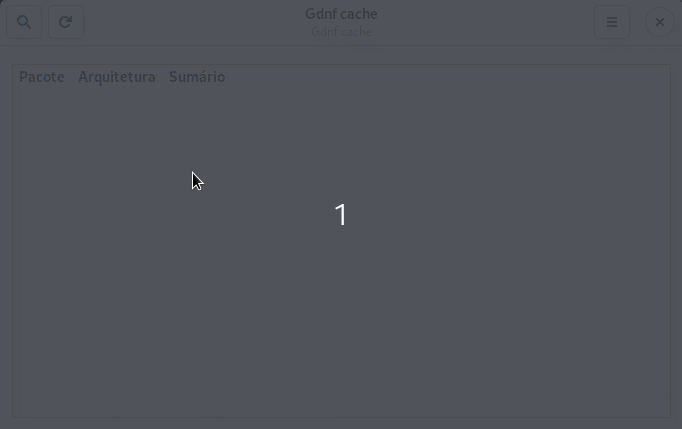

# Gdnf-cache



## Como utilizar

[Como utilizar o Gdnf cache](./docs/how-to-use-gdnf-cache.md).

## Como desenvolver

Faça download ou clone este repositório.

Verifique se a biblioteca `python3-dnf` está instalada.

Caso não esteja:

```bash
sudo dnf install python3-dnf
```

> **OBS**: A biblioteca `dnf` que é importada em alguns scripts não funciona dentro de ambientes virtuais (pipenv, venv, etc). Utilize o interpretador Python do sistema para a execução do código.

Na função `def get_package_by_name(self, name, limit=10)` do script `ConnectSQLite.py` está sendo utilizado o parâmetro `limit` para evitar consultadas longas de mais. Edite conforme a sua necessidade.

Em sistemas baseados em GTK as bibliotecas necessárias costumam estar instaladas, caso não estejam acesse este meu outro repositório para ver como realizar a configuração do ambiente de de desenvolvimento.

- [https://github.com/natorsc/gui-python-gtk](https://github.com/natorsc/gui-python-gtk).

## Releases

- 14/05/2020 [Gdnf cache 0.2.0](https://github.com/natorsc/gdnf-cache/releases/tag/v0.2.0).
- 06/05/2020 - [Gdnf cache 0.1.0](https://github.com/natorsc/gdnf-cache/releases/tag/v0.1.0) :tada:.

## Agradecimentos

Ao canal [debxp linux](https://www.youtube.com/channel/UC8EGrwe_DXSzrCQclf_pv9g) no YouTube.

Link para live onde a ideia foi exibida:

- [Live Coding #17 - Apresentando o script DNF-CACHE!](https://youtu.be/4drCw9fXfnw).

Repositório onde está sendo desenvolvido o `dnf-cache`, que é a versão cli (para se utilizar via terminal):

- [dnf-cache](https://gitlab.com/blau_araujo/dnf-cache)