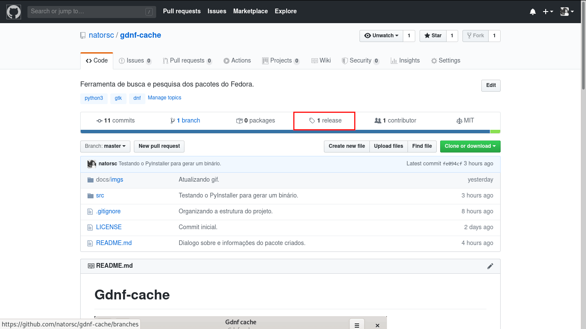
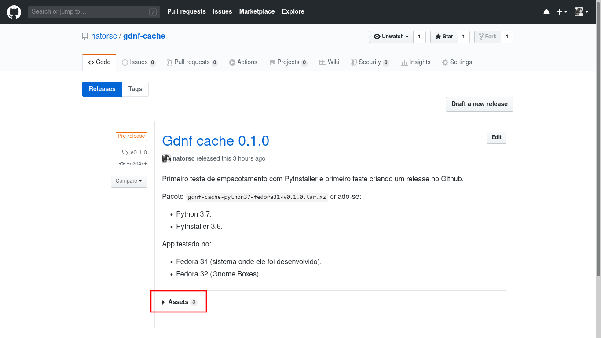
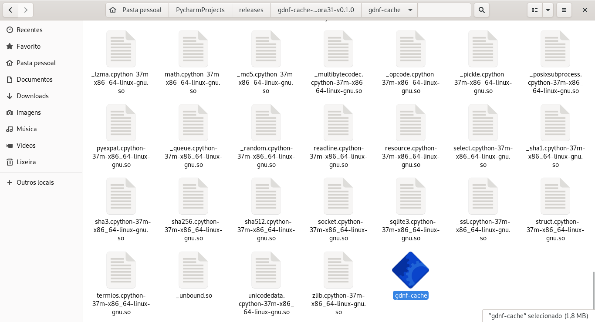
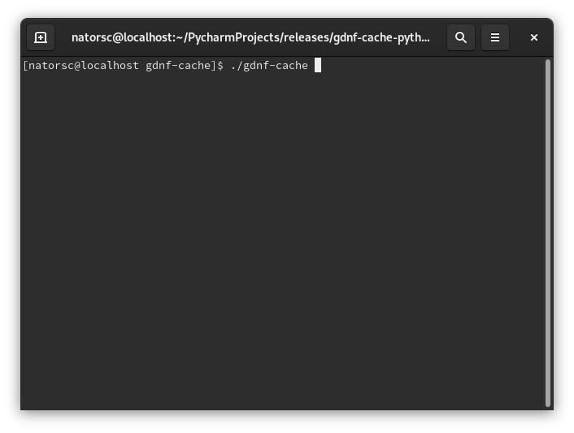

# Gdnf-cache


---

## Como utilizar

### Via git clone

Faça download ou clone este repositório com:

```bash
git clone https://github.com/natorsc/gdnf-cache.git
```

Acesse a pasta e excute o arquivo `install_gdnf_cache.py`:

```bash
python3 install_gdnf_cache.py
```

Ao executar o comando acima os arquivos da pasta `src` serão copiados para `/home/SeuUsuário/.gdnf-cache` e um arquivo do tipo desktop entry será criado e copiado para o diretório `/home/SeuUsuário/.local/share/applications`.

Com o final da instalação procure pelo **Gdnf cache** no menu da distribuição:


Para realizar o remoção do programa basta acessar `/home/SeuUsuário/.gdnf-cache` e executar o arquivo `remove_gdnf_cache.py`:

```bash
python3 remove_gdnf_cache.py
```

---

### Via release

Clique na aba **releases** do Github:



Ao acessar a aba releases clique na opção **Assets**:



Realize o download de um dos arquivos com extensão `tar.xz`.

> **OBS**: Caso um deles não funcione tente o outro.

Ao concluir o download descompacte o conteúdo.

O aplicativo pode ser utilizado no local onde foi descompactado ou copiado para uma pasta de sua preferencia (aplicativo funciona como um portable).

Dentro do conteudo extraido procure pelo binario `GdnfCache`, de 2 cliques sobre o mesmo e aguarde:



Caso o aplicativo não inicie, abra um terminal na mesma pasta do binario (`GdnfCache`) e execute `./GdnfCache`:



Caso seja exibida alguma mensagem de erro favor reportar o mesmo :joy:. 

---

## Como desenvolver

Faça download ou clone este repositório.

Verifique se a biblioteca `python3-dnf` está instalada.

Caso não esteja:

```bash
sudo dnf install python3-dnf
```

> **OBS**: A biblioteca `dnf` que é importada em alguns scripts não funciona dentro de ambientes virtuais (pipenv, venv, etc). Utilize o interpretador Python do sistema para a execução do código.

Na função `def get_package_by_name(self, name, limit=10)` do script `ConnectSQLite.py` está sendo utilizado o parâmetro `limit` para evitar consultadas longas de mais. Edite conforme a sua necessidade.

Em sistemas baseados em GTK as bibliotecas necessárias costumam estar instaladas, caso não estejam acesse este meu outro repositório para ver como realizar a configuração do ambiente de de desenvolvimento.

- [https://github.com/natorsc/gui-python-gtk](https://github.com/natorsc/gui-python-gtk).

## Releases

- 01/06/2020 [Gdnf cache 0.3.0](https://github.com/natorsc/gdnf-cache/releases/tag/v0.3.0)
- 14/05/2020 [Gdnf cache 0.2.0](https://github.com/natorsc/gdnf-cache/releases/tag/v0.2.0).
- 06/05/2020 - [Gdnf cache 0.1.0](https://github.com/natorsc/gdnf-cache/releases/tag/v0.1.0) :tada:.

## Agradecimentos

Ao canal [debxp linux](https://www.youtube.com/channel/UC8EGrwe_DXSzrCQclf_pv9g) no YouTube.

Link para live onde a ideia foi exibida:

- [Live Coding #17 - Apresentando o script DNF-CACHE!](https://youtu.be/4drCw9fXfnw).

Repositório onde está sendo desenvolvido o `dnf-cache`, que é a versão cli (para se utilizar via terminal):

- [dnf-cache](https://gitlab.com/blau_araujo/dnf-cache)
