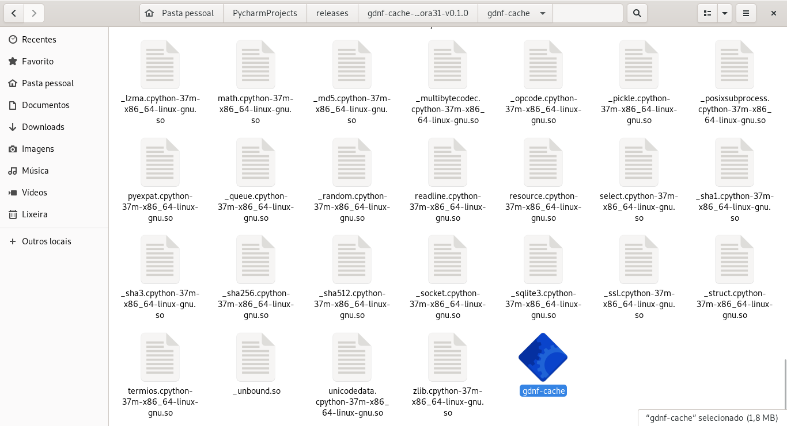
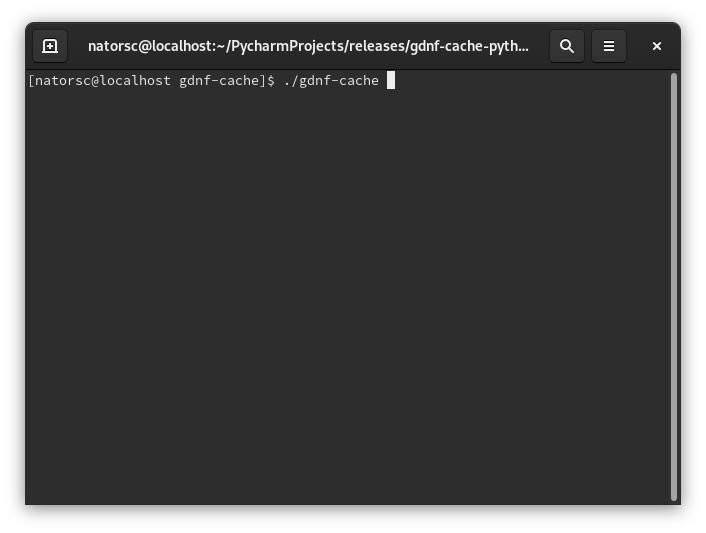

# Como utilizar o Gdnf cache

Clique na aba **releases** do Github:

Ao acessar a aba releases clique na opção **Assets**:

Localize o arquivo com extensão `tar.xz` e realize o download do mesmo.

Ao concluir o download descompacte o conteúdo.

O aplicativo pode ser utilizado no local onde foi descompactado ou copiado para uma pasta de sua preferencia (aplicativo funciona como um portable).

Dentro do conteudo extraido procure pelo binario `gdnf-cache`, de 2 cliques sobre o mesmo e aguarde:

Caso o aplicativo não inicie, abra um terminal na mesma pasta do binario (`gdnf-cache`) e execute `./gdnf-cache`:

Caso seja exibida alguma mensagem de erro favor reportar o erro :joy:. 
